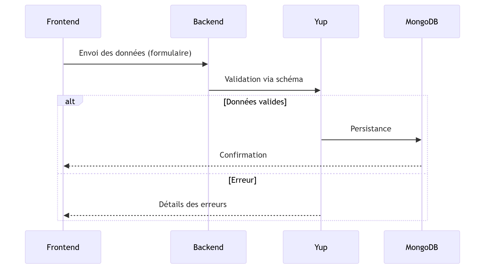

# PROGEASE Project

<p align="center">
  
</p>

## 🚀 Introduction

**PROGEASE** est une plateforme centralisée conçue pour améliorer la gestion des projets étudiants dans un cadre universitaire. Elle aide les étudiants, tuteurs et administrateurs à gérer efficacement les projets grâce à des fonctionnalités innovantes telles que l'automatisation, la collaboration en temps réel, et l'analyse des performances des projets.

---

## 🧑‍💻 Équipe de Développement

| **Développeur**         | **Modules**               |
|--------------------------|---------------------------|
| Ghofrane Toukebri        | Formation & Certification |
| Yosr Ben Hammadi         | Système d'Évaluation      |
| Imen Ferchichi           | Gestion des Utilisateurs  |
| Karim Troudi             | Gestion du Forum          |
| Walid Ben Touhami        | Gestion des Projets       |

---

## 🌟 Fonctionnalités Principales

### **Gestion des Projets**
- Ajouter, modifier et supprimer des projets.
- Suivre l'avancement des projets en temps réel.
- Prédire les performances grâce à des algorithmes d'IA.

### **Gestion des Utilisateurs**
- Gestion des rôles : étudiant, tuteur, administrateur.
- Authentification et autorisation sécurisées.

### **Système d'Évaluation**
- Ajout et gestion des évaluations pour les projets.
- Gestion des scores et des commentaires des évaluateurs.

### **Formation et Certification**
- Gestion des formations et certifications pour les étudiants.

### **Gestion du Forum**
- Création et gestion des discussions entre membres des équipes.

### **Sécurité et Fiabilité**
- Authentification sécurisée avec validation via **Yup**.
- Protection des données sensibles côté backend.

<p align="center">
  
</p>

---

## 🛠️ Technologies Utilisées

- **Backend** : Node.js, Express.js
- **Base de données** : MongoDB
- **AI** : TensorFlow.js, scikit-learn
- **Validation** : Yup

---

## ⚙️ Installation et Configuration

### **Prérequis**
- Node.js (v16 ou supérieur)
- npm (v7 ou supérieur)
- MongoDB

### **Étapes d'installation**

1. **Cloner le dépôt :**
   ```bash
   git clone <URL_DU_DEPOT>
   cd <NOM_DU_DEPOT>
   ```

2. **Installer les dépendances :**
   ```bash
   npm install
   ```

3. **Configurer les variables d'environnement :**
   Créez un fichier `.env` à la racine du projet et ajoutez les variables suivantes :
   ```env
   PORT=3000
   NODE_ENV=development
   MONGO_URI=mongodb://localhost:27017/progease
   CORS_ORIGINS=http://localhost:3000
   ```

4. **Lancer l'application :**
   ```bash
   npm start
   ```

5. **Accéder à l'application :**
   - **API REST** : [http://localhost:4000/api/v1/](http://localhost:4000/api/v1/)
   - **GraphQL Playground** : [http://localhost:4000/graphql](http://localhost:4000/graphql)

---

## 🧪 Tests

Pour exécuter les tests, utilisez la commande suivante :
```bash
npm test
```

### **Tests inclus :**
- Tests unitaires pour les modules principaux.
- Tests d'intégration pour les routes REST et GraphQL.

---

## 📂 Structure Globale du Backend

### **Structure des Dossiers**
<details>
  <summary>📂 Cliquez pour afficher la structure</summary>

```
backend
|-- config
|   |-- constants.js
|   `-- db.json
|-- package-lock.json
|-- package.json
|-- server.js
`-- src
    |-- controllers
    |   |-- evaluation.controller.js
    |   |-- formation&certification.controller.js
    |   |-- forum.controller.js
    |   |-- project.controller.js
    |   `-- user.controller.js
    |-- middlewares
    |   |-- evaluation.middleware.js
    |   |-- formation&certification.middleware.js
    |   |-- forum.middleware.js
    |   |-- project.middleware.js
    |   `-- user.middleware.js
    |-- models
    |   |-- evaluation.model.js
    |   |-- formation&certification.model.js
    |   |-- forum.model.js
    |   |-- project.model.js
    |   `-- user.model.js
    |-- routers
    |   |-- evaluation.router.js
    |   |-- formation&certification.router.js
    |   |-- forum.router.js
    |   |-- project.router.js
    |   `-- user.router.js
    |-- schema.js
    |-- services
    |   |-- evaluation.service.js
    |   |-- formation&certification.service.js
    |   |-- forum.service.js
    |   |-- project.service.js
    |   `-- user.service.js
    `-- utils
        |-- date.util.js
        `-- github.util.js
```

</details>

---

## 📊 Modules et Arborescence

<p align="center">
  
</p>

---

## 🤝 Contributions

Les contributions sont les bienvenues ! Veuillez suivre ces étapes pour proposer des modifications :
1. **Forkez le dépôt.**
2. **Créez une branche pour vos modifications.**
   ```bash
   git checkout -b feature/nom-feature
   ```
3. **Soumettez un pull request.**

N'hésitez pas à ouvrir une issue pour discuter des améliorations.

---

## 📜 Licence

Ce projet est sous licence **MIT**. Consultez le fichier `LICENSE` pour plus de détails.

---

## 🔗 Liens Utiles

- **Documentation API** : [Lien vers la documentation](http://localhost:4000/api-docs)
- **Documentation GraphQL** : [Lien vers GraphQL Playground](http://localhost:4000/graphql)
- **Dépôt GitHub** : [Lien vers le dépôt](<URL_DU_DEPOT>)