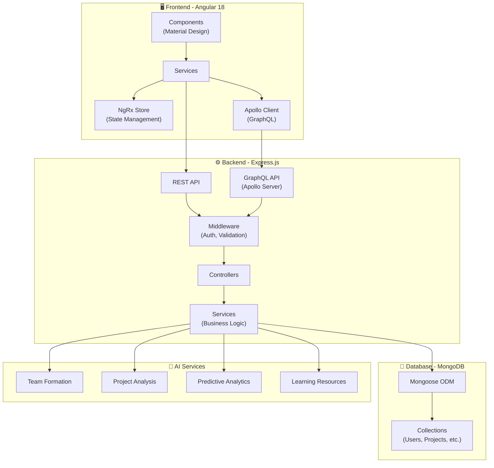
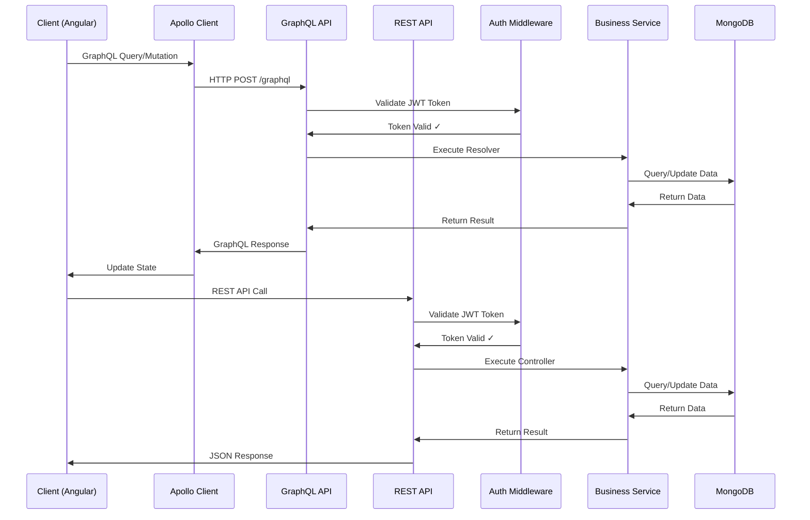
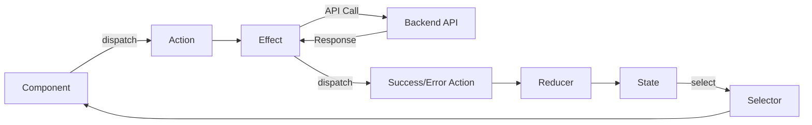
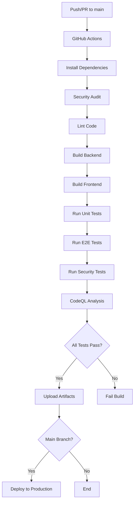
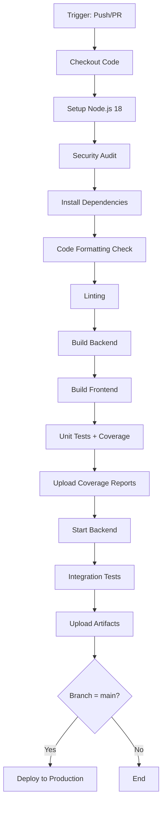

# 🚀 PROGEASE — Plateforme de Gestion de Projets avec IA

## ⚡ Full-Stack Edition — Angular · GraphQL · MongoDB · AI-Powered · REST API · CI/CD

---

<p align="center">
  
  
  
  
  
</p>

---

## 🔧 Badges GitHub Actions (CI/CD)

| Workflow | Status |
|----------|--------|
| CI Build & Test |  |
| Unit & E2E Tests |  |
| CodeQL Security |  |

**Qualité & Sécurité**
[](https://helmetjs.github.io/)
[](https://www.npmjs.com/package/express-rate-limit)
[](https://express-validator.github.io/)
[](https://www.npmjs.com/package/xss-clean)
[](https://github.com/prettier/prettier)
[](https://eslint.org/)

### 📋 Versions & Compatibilité

**Runtime**
- 🟢 **Node.js Backend**: ≥18.0.0 (LTS stable)
- 🟢 **Node.js Frontend**: ≥20.0.0 (requis pour Angular 18.2+ et performances optimales)
- 🟢 **npm**: ≥10.0.0
- 🟢 **MongoDB**: 5.0+

**Stack Technologique**
- 🔴 **Frontend**: Angular 18.2.14 + Angular Material + NgRx
- ⚫ **Backend**: Node.js + Express.js 4.18.2
- 🟣 **API**: GraphQL (Apollo Server) + REST
- 🟢 **Database**: MongoDB + Mongoose ODM
- 🔵 **TypeScript**: 5.4.5

---

## 📚 Table des Matières

1. [🎯 Aperçu du Projet](#aperçu-du-projet)
2. [✨ Fonctionnalités](#fonctionnalités)
3. [🧠 Architecture & Diagrammes](#architecture-diagrammes)
4. [🛠 Installation & Setup](#installation-setup)
5. [🏗️ Build & Compilation](#build-compilation)
6. [🚀 Démarrage de l'Application](#démarrage-de-lapplication)
7. [🧪 Tests & Validation](#tests-validation)
8. [📡 API Documentation](#api-documentation)
9. [📂 Structure du Projet](#structure-du-projet)
10. [🔒 Sécurité](#sécurité)
11. [⚙️ Workflows CI/CD](#workflows-cicd)
12. [🤝 Contribution](#contribution)
13. [📜 Licence](#licence)
14. [📞 Support](#support)

---

## 🎯 Aperçu du Projet

### 🇫🇷 Version Française

PROGEASE est une **plateforme de gestion de projets moderne** avec des fonctionnalités d'intelligence artificielle avancées.

**Architecture**:
| Composant | Technologie | Description |
|-----------|-------------|-------------|
| **Frontend** | Angular 18.2.14 | Application SPA avec Material Design |
| **Backend** | Express.js 4.18.2 | API REST + GraphQL |
| **Base de données** | MongoDB 5.0+ | Base de données NoSQL |
| **État** | NgRx | Gestion d'état Redux-like |
| **API** | GraphQL + REST | API hybride flexible |

Fonctionnalités clés :

✔ Gestion complète de projets et équipes

✔ Intelligence Artificielle intégrée

✔ GraphQL + REST API

✔ Authentification JWT sécurisée

✔ Tests automatisés (Unit, E2E, Security)

✔ CI/CD complet avec GitHub Actions

✔ Monitoring et logging avancés

### 🇬🇧 English Summary

PROGEASE is a **modern project management platform** with advanced AI capabilities:

✔ Full-stack TypeScript/JavaScript application

✔ AI-powered team formation and project analysis

✔ Dual API (GraphQL + REST)

✔ Comprehensive test coverage

✔ Production-ready security features

---

## ✨ Fonctionnalités

### 👥 Administration & Gestion Utilisateurs
- **Gestion complète des utilisateurs**
  - 👤 Création, modification, suppression d'utilisateurs
  - 🔐 Gestion des rôles (ADMIN, USER, MANAGER)
  - 📊 Suivi des connexions et activité
  - 📈 Tableau de bord statistiques en temps réel
- **Analytics**
  - 📊 Nombre total d'utilisateurs
  - ✅ Utilisateurs actifs/inactifs
  - 🚀 Projets en cours et terminés
  - 📈 Taux de complétion et KPIs

### 🤖 Intelligence Artificielle (AI)
- **🔍 Analyse de Projets**
  - Analyse automatique des projets
  - Génération de recommandations intelligentes
  - Évaluation automatisée des livrables
  - Rapports d'avancement détaillés
- **👥 Formation Intelligente d'Équipes**
  - Optimisation basée sur les compétences
  - Équilibrage des niveaux d'expérience
  - Respect des préférences de collaboration
  - Algorithmes de matching avancés
- **🎯 Association Tuteurs-Projets**
  - Matching intelligent basé sur les compétences
  - Équilibrage automatique de la charge
  - Compatibilité thématique
  - Optimisation des ressources
- **📈 Analyse Prédictive**
  - Prédiction des résultats de projet
  - Identification proactive des risques
  - Analyse des tendances de progression
  - Alertes préventives
- **📊 Suivi Automatisé**
  - Calcul automatique du pourcentage d'avancement
  - Statistiques en temps réel
  - Alertes sur les retards
  - Dashboard de progression
- **📚 Ressources d'Apprentissage Personnalisées**
  - Recommandations de cours en ligne
  - Suggestions de livres et projets pratiques
  - Connexion aux communautés d'apprentissage
  - Parcours personnalisés
- **📅 Planification & Rappels Automatisés**
  - Génération automatique de planning
  - Rappels intelligents pour les échéances
  - Détection de conflits d'horaires
  - Planification de réunions et soutenances

### 🔐 Gestion des Sessions & Sécurité
- **Authentification Sécurisée**
  - 🔒 JWT (JSON Web Tokens)
  - 🔄 Rafraîchissement automatique des tokens
  - ⏱️ Gestion de l'inactivité
  - 🚪 Déconnexion automatique
- **Protection Multi-Couches**
  - 🛡️ Helmet (sécurité headers HTTP)
  - ⏱️ Rate Limiting (prévention DoS)
  - ✅ Validation des entrées (express-validator)
  - 🧹 XSS Protection (xss-clean)
  - 🔐 NoSQL Injection Prevention

### 🔔 Système de Notifications
- **Notifications en Temps Réel**
  - ✅ Succès (vert)
  - ❌ Erreur (rouge)
  - ℹ️ Information (bleu)
  - ⚠️ Avertissement (orange)
  - 🎨 Animations fluides et professionnelles

---

## 🧠 Architecture & Diagrammes

### Architecture Globale



### Architecture API (GraphQL + REST)



### Flux de Données NgRx



### Pipeline CI/CD



---

## 🛠 Installation & Setup

### Prérequis Système

**Obligatoire**:
```bash
# Vérifier les versions installées
node --version    # Backend: ≥18.0.0, Frontend: ≥20.0.0
npm --version     # ≥10.0.0
mongod --version  # ≥5.0

# Ubuntu/Debian
sudo apt install -y nodejs npm mongodb

# macOS (Homebrew)
brew install node mongodb-community

# Windows (Chocolatey)
choco install nodejs mongodb
```

**Optionnel**:
```bash
# Python 3.6+ pour le script d'installation automatique
python3 --version

# Git pour le clonage
git --version
```

### Installation Complète

#### Méthode 1: Script Python (Recommandé) 🌟

```bash
# 1. Cloner le dépôt
git clone https://github.com/WalidBenTouhami/PROGEASE.git
cd PROGEASE

# 2. Installation automatique avec le script Python
python3 install_all.py

# Options disponibles:
python3 install_all.py --clean           # Nettoyer node_modules avant installation
python3 install_all.py --backend-only    # Installer uniquement le backend
python3 install_all.py --frontend-only   # Installer uniquement le frontend
python3 install_all.py --help            # Afficher l'aide complète
```

Le script `install_all.py` effectue automatiquement :
- ✅ Vérification des prérequis système
- ✅ Installation des dépendances root
- ✅ Installation des dépendances backend
- ✅ Installation des dépendances frontend (avec gestion des peer dependencies)
- ✅ Vérification post-installation
- ✅ Résumé détaillé avec instructions

#### Méthode 2: Scripts npm

```bash
# Installation de toutes les dépendances (root, backend, frontend)
npm run install-all

# Nettoyage complet avant installation
npm run clean && npm run install-all
```

#### Méthode 3: Installation Manuelle

```bash
# 1. Installation des dépendances root
npm install

# 2. Installation des dépendances backend
cd backend
npm install
cd ..

# 3. Installation des dépendances frontend
# Note: --legacy-peer-deps est automatiquement configuré dans frontend/.npmrc
cd frontend
npm install
cd ..
```

### Configuration de l'Environnement

```bash
# 1. Copier le fichier d'exemple
cp env.example .env

# 2. Éditer .env avec vos configurations
nano .env  # ou vim, code, etc.
```

**Variables d'environnement essentielles**:
```bash
# MongoDB
MONGODB_URI=mongodb://localhost:27017/progease

# Serveur
NODE_ENV=development
PORT=5000

# JWT Authentication
JWT_SECRET=votre_secret_jwt_super_securise
JWT_EXPIRE=24h
JWT_REFRESH_SECRET=votre_refresh_secret

# CORS
CORS_ORIGINS=http://localhost:4200,http://localhost:3000

# GraphQL
GRAPHQL_URL=http://localhost:5000/graphql

# Email (optionnel pour les notifications)
SMTP_HOST=smtp.gmail.com
SMTP_PORT=587
SMTP_USER=votre_email@gmail.com
SMTP_PASS=votre_mot_de_passe
```

### Démarrage du Serveur MongoDB

```bash
# Démarrer MongoDB (si pas déjà en cours)
# Ubuntu/Debian
sudo systemctl start mongod
sudo systemctl enable mongod  # Démarrage automatique

# macOS
brew services start mongodb-community

# Windows
net start MongoDB

# Vérifier le statut
mongo --eval "db.version()"
```

---

## 🏗️ Build & Compilation

### Build Standard (Production)

```bash
# Build backend
cd backend
npm run build

# Build frontend
cd ../frontend
npm run build

# Les builds sont créés dans:
# backend/dist/
# frontend/dist/
```

### Build avec Optimisations

```bash
# Frontend - Production optimisé
cd frontend
npm run build -- --configuration production

# Options de build avancées
npm run build -- --configuration production --aot --build-optimizer
```

### Modes de Compilation

| Mode | Commande | Optimisations | Usage |
|------|----------|---------------|-------|
| **Development** | `npm run build` | Minimal, source maps | Développement |
| **Production** | `npm run build -- --configuration production` | AOT, minification, tree-shaking | Production |
| **Watch** | `npm run watch` | Hot reload | Développement continu |

### Linting & Formatting

```bash
# Backend
cd backend
npm run lint              # Vérifier le code
npm run lint:fix          # Corriger automatiquement
npm run format:check      # Vérifier le formatage
npm run format            # Formater le code

# Frontend
cd frontend
npm run lint              # Vérifier le code
npm run lint -- --fix     # Corriger automatiquement
```

---

## 🚀 Démarrage de l'Application

### Démarrage Complet (Backend + Frontend)

```bash
# Démarrer backend et frontend simultanément
npm start

# Le frontend sera accessible à: http://localhost:4200
# Le backend API sera accessible à: http://localhost:5000
# GraphQL Playground: http://localhost:5000/graphql
```

### Démarrage Séparé

#### Backend Uniquement

```bash
# Mode production
cd backend
npm start

# Mode développement avec nodemon (hot reload)
cd backend
npm run dev

# Avec MongoDB intégré (MongoDB Memory Server)
cd backend
npm run start:all
```

#### Frontend Uniquement

```bash
# Mode développement
cd frontend
npm start
# Ouvre automatiquement http://localhost:4200

# Mode production local
cd frontend
npm run build
npm run serve:ssr:frontend
```

### Vérification du Statut

```bash
# Vérifier les processus en cours
ps aux | grep node

# Vérifier les ports en écoute
# Linux/macOS
netstat -tuln | grep -E ":(4200|5000|27017)"
# ou
lsof -i :4200,5000,27017

# Windows
netstat -ano | findstr ":4200 :5000 :27017"
```

### Accès à l'Application

| Service | URL | Description |
|---------|-----|-------------|
| **Frontend** | http://localhost:4200 | Application Angular |
| **Backend API** | http://localhost:5000/api | REST API |
| **GraphQL** | http://localhost:5000/graphql | GraphQL Playground |
| **MongoDB** | mongodb://localhost:27017 | Base de données |

---

## 🧪 Tests & Validation

### Tests Unitaires

```bash
# Exécuter tous les tests
npm test

# Backend uniquement
cd backend
npm test                    # Tous les tests backend
npm run test:watch          # Mode watch (développement)
npm run test:coverage       # Avec rapport de couverture

# Frontend uniquement
cd frontend
npm test                    # Tests Karma/Jasmine
npm run test:ci             # Mode CI (headless)
```

### Tests E2E (End-to-End)

```bash
# Tous les tests E2E avec Cypress
cd frontend
npm run test:e2e            # Mode headless
npm run test:e2e:open       # Mode interactif (GUI)

# Tests spécifiques
npm run test:security       # Tests de sécurité
npm run test:accessibility  # Tests d'accessibilité
npm run test:performance    # Tests de performance

# Suite complète
npm run test:all            # Tous les tests (unit + e2e + security + a11y + perf)
```

### Rapports de Couverture

```bash
# Générer les rapports de couverture
npm run test:coverage

# Les rapports sont disponibles dans:
# backend/coverage/lcov-report/index.html
# frontend/coverage/lcov-report/index.html

# Ouvrir le rapport dans le navigateur
# Linux/macOS
open backend/coverage/lcov-report/index.html
# Windows
start backend/coverage/lcov-report/index.html
```

### Tests de Sécurité

```bash
# Audit de sécurité npm
npm audit
npm audit --production      # Production uniquement

# Backend
cd backend
npm audit
npm audit fix               # Correction automatique

# Frontend
cd frontend
npm audit
npm audit fix
```

### Tests Manuels

#### Smoke Tests - Backend API

```bash
# 1. Démarrer le backend
cd backend && npm run dev

# 2. Tests REST API (dans un autre terminal)
# Health check
curl http://localhost:5000/api/health

# GraphQL introspection
curl -X POST http://localhost:5000/graphql \
  -H "Content-Type: application/json" \
  -d '{"query": "{ __schema { queryType { name } } }"}'
```

#### Smoke Tests - Frontend

```bash
# 1. Démarrer le frontend
cd frontend && npm start

# 2. Ouvrir dans le navigateur
# http://localhost:4200

# Vérifier:
# ✓ Page de connexion s'affiche
# ✓ Pas d'erreurs dans la console
# ✓ Assets chargés correctement
```

### Validation du Build

```bash
# Vérifier que les builds se compilent sans erreur
cd backend && npm run build
cd ../frontend && npm run build

# Vérifier la taille des bundles
cd frontend
npm run build -- --stats-json
npx webpack-bundle-analyzer dist/frontend/stats.json
```

---

## 📡 API Documentation

### REST API

#### Endpoints Intelligence Artificielle

| Endpoint | Méthode | Description | Auth |
|----------|---------|-------------|------|
| `/api/ai/form-teams` | POST | Formation d'équipes intelligente | ✓ |
| `/api/ai/match-tutors` | POST | Association tuteurs-projets | ✓ |
| `/api/ai/learning-resources` | POST | Recommandations d'apprentissage | ✓ |
| `/api/ai/track-progress` | POST | Suivi automatisé de progression | ✓ |
| `/api/ai/predict-performance/:projetId` | POST | Analyse prédictive de performance | ✓ |
| `/api/ai/generate-schedule` | POST | Génération de planning | ✓ |
| `/api/ai/analyze` | POST | Analyse de projet | ✓ |

#### Endpoints Planification

| Endpoint | Méthode | Description | Auth |
|----------|---------|-------------|------|
| `/api/scheduling/reminders/:projetId` | GET | Génération de rappels | ✓ |
| `/api/scheduling/events/:projetId` | POST | Planification d'événements | ✓ |
| `/api/scheduling/notifications` | POST | Envoi de notifications | ✓ |
| `/api/scheduling/conflicts` | POST | Détection de conflits | ✓ |
| `/api/scheduling/complete/:projetId` | GET | Planning complet | ✓ |

### Exemples de Requêtes REST

#### 1. Formation d'Équipes

```bash
POST /api/ai/form-teams
Authorization: Bearer <token>
Content-Type: application/json

{
  "membres": [
    {
      "id": "user1",
      "nom": "Alice Dupont",
      "competences": ["JavaScript", "React", "Node.js"],
      "niveau": "INTERMEDIAIRE",
      "disponibilite": "TEMPS_PLEIN"
    },
    {
      "id": "user2",
      "nom": "Bob Martin",
      "competences": ["Python", "Django", "PostgreSQL"],
      "niveau": "AVANCE",
      "disponibilite": "TEMPS_PARTIEL"
    }
  ]
}
```

**Réponse**:
```json
{
  "success": true,
  "equipes": [
    {
      "id": "team1",
      "membres": ["user1", "user3"],
      "score": 0.85,
      "raison": "Complémentarité des compétences frontend/backend"
    }
  ]
}
```

#### 2. Analyse Prédictive

```bash
POST /api/ai/predict-performance/proj123
Authorization: Bearer <token>
Content-Type: application/json

{
  "historique": [
    { "date": "2024-01-01", "progression": 20 },
    { "date": "2024-02-01", "progression": 45 }
  ]
}
```

**Réponse**:
```json
{
  "success": true,
  "prediction": {
    "tauxReussite": 0.78,
    "risques": ["Retard potentiel sur milestone 3"],
    "recommendations": ["Augmenter les ressources sur module X"]
  }
}
```

#### 3. Génération de Planning

```bash
POST /api/ai/generate-schedule
Authorization: Bearer <token>
Content-Type: application/json

{
  "taches": [
    {
      "id": "t1",
      "titre": "Design UI",
      "duree": 5,
      "priorite": "HAUTE"
    },
    {
      "id": "t2",
      "titre": "API Backend",
      "duree": 8,
      "priorite": "HAUTE",
      "dependances": ["t1"]
    }
  ],
  "dateDebut": "2024-01-15",
  "dateFin": "2024-03-15"
}
```

**Réponse**:
```json
{
  "success": true,
  "planning": {
    "taches": [
      {
        "id": "t1",
        "debut": "2024-01-15",
        "fin": "2024-01-19"
      },
      {
        "id": "t2",
        "debut": "2024-01-22",
        "fin": "2024-01-31"
      }
    ],
    "conflits": [],
    "alertes": []
  }
}
```

### GraphQL API

#### Queries & Mutations Disponibles

```graphql
# Exemples de queries
query {
  # Récupérer tous les projets
  projets {
    id
    nom
    description
    statut
    membres {
      id
      nom
      role
    }
  }
  
  # Récupérer un utilisateur
  utilisateur(id: "user123") {
    id
    nom
    email
    role
    projets {
      id
      nom
    }
  }
}

# Exemples de mutations
mutation {
  # Créer un projet
  creerProjet(input: {
    nom: "Nouveau Projet"
    description: "Description du projet"
    dateDebut: "2024-01-15"
    dateFin: "2024-06-15"
  }) {
    id
    nom
    statut
  }
  
  # Mettre à jour un projet
  mettreAJourProjet(
    id: "proj123"
    input: {
      statut: "EN_COURS"
      progression: 45
    }
  ) {
    id
    statut
    progression
  }
}
```

### Authentification

Toutes les requêtes API nécessitent un token JWT:

```bash
# Header requis
Authorization: Bearer <votre_token_jwt>

# Obtenir un token
POST /api/auth/login
Content-Type: application/json

{
  "email": "user@example.com",
  "password": "votre_mot_de_passe"
}
```

**Réponse**:
```json
{
  "success": true,
  "token": "eyJhbGciOiJIUzI1NiIsInR5cCI6IkpXVCJ9...",
  "refreshToken": "eyJhbGciOiJIUzI1NiIsInR5cCI6IkpXVCJ9...",
  "user": {
    "id": "user123",
    "nom": "John Doe",
    "email": "user@example.com",
    "role": "USER"
  }
}
```

### Format des Réponses

#### Succès
```json
{
  "success": true,
  "data": { /* données */ },
  "message": "Opération réussie"
}
```

#### Erreur
```json
{
  "success": false,
  "error": {
    "code": "VALIDATION_ERROR",
    "message": "Les données fournies sont invalides",
    "details": [
      {
        "field": "email",
        "message": "Format d'email invalide"
      }
    ]
  }
}
```

### Codes d'Erreur HTTP

| Code | Signification | Description |
|------|---------------|-------------|
| 200 | OK | Requête réussie |
| 201 | Created | Ressource créée |
| 400 | Bad Request | Données invalides |
| 401 | Unauthorized | Non authentifié |
| 403 | Forbidden | Accès refusé |
| 404 | Not Found | Ressource introuvable |
| 429 | Too Many Requests | Rate limit dépassé |
| 500 | Internal Server Error | Erreur serveur |

### Documentation Interactive

- **GraphQL Playground**: http://localhost:5000/graphql
- **API Documentation complète**: Voir [API_DOCUMENTATION.md](./API_DOCUMENTATION.md)

---

## 📂 Structure du Projet

### Vue d'Ensemble

```
PROGEASE/
├── backend/                          # 🟢 Backend Node.js/Express
│   ├── src/
│   │   ├── controllers/              # Contrôleurs REST
│   │   │   ├── utilisateur.controller.js
│   │   │   ├── projet.controller.js
│   │   │   ├── evaluation.controller.js
│   │   │   ├── aiController.js       # IA - Fonctionnalités
│   │   │   └── schedulingController.js
│   │   ├── graphql/                  # API GraphQL
│   │   │   ├── schemas/              # Schémas GraphQL
│   │   │   │   ├── utilisateur.schema.js
│   │   │   │   ├── projet.schema.js
│   │   │   │   ├── evaluation.schema.js
│   │   │   │   └── schema.js         # Fusion des schémas
│   │   │   └── resolvers/            # Résolveurs GraphQL
│   │   │       ├── utilisateur.resolver.js
│   │   │       ├── projet.resolver.js
│   │   │       └── evaluation.resolver.js
│   │   ├── models/                   # Modèles Mongoose
│   │   │   ├── utilisateur.model.js
│   │   │   ├── projet.model.js
│   │   │   ├── livrable.model.js
│   │   │   ├── evaluation.model.js
│   │   │   ├── formation.model.js
│   │   │   └── quiz.model.js
│   │   ├── routes/                   # Routes REST
│   │   │   ├── utilisateur.routes.js
│   │   │   ├── projet.routes.js
│   │   │   ├── ai.routes.js
│   │   │   └── scheduling.routes.js
│   │   ├── services/                 # Logique métier
│   │   │   ├── ai.service.js         # Services IA
│   │   │   ├── email.service.js
│   │   │   └── scheduling.service.js
│   │   ├── middleware/               # Middleware Express
│   │   │   ├── auth.js               # Authentification JWT
│   │   │   ├── validation.js         # Validation des données
│   │   │   ├── rateLimiter.js        # Rate limiting
│   │   │   └── errorHandler.js       # Gestion d'erreurs
│   │   ├── utils/                    # Utilitaires
│   │   │   ├── logger.js             # Winston logger
│   │   │   └── validators.js         # Validateurs personnalisés
│   │   ├── config/                   # Configuration
│   │   │   ├── database.js           # Config MongoDB
│   │   │   └── apollo.js             # Config Apollo Server
│   │   └── server.js                 # Point d'entrée serveur
│   ├── tests/                        # Tests backend
│   │   ├── unit/                     # Tests unitaires
│   │   ├── integration/              # Tests d'intégration
│   │   └── graphql/                  # Tests GraphQL
│   ├── package.json
│   └── .npmrc
│
├── frontend/                         # 🔴 Frontend Angular
│   ├── src/
│   │   ├── app/
│   │   │   ├── core/                 # Module core
│   │   │   │   ├── guards/           # Guards de routing
│   │   │   │   │   ├── auth.guard.ts
│   │   │   │   │   └── role.guard.ts
│   │   │   │   ├── interceptors/     # Intercepteurs HTTP
│   │   │   │   │   ├── auth.interceptor.ts
│   │   │   │   │   ├── error.interceptor.ts
│   │   │   │   │   └── loading.interceptor.ts
│   │   │   │   └── services/         # Services core
│   │   │   ├── features/             # Modules fonctionnels
│   │   │   │   ├── admin/            # Module admin
│   │   │   │   │   ├── components/
│   │   │   │   │   ├── services/
│   │   │   │   │   └── admin.routes.ts
│   │   │   │   ├── ai/               # Module IA
│   │   │   │   │   ├── components/
│   │   │   │   │   ├── services/
│   │   │   │   │   └── ai.routes.ts
│   │   │   │   ├── projects/         # Gestion projets
│   │   │   │   ├── auth/             # Authentification
│   │   │   │   └── dashboard/        # Tableau de bord
│   │   │   ├── shared/               # Composants partagés
│   │   │   │   ├── components/       # Composants réutilisables
│   │   │   │   ├── pipes/            # Pipes Angular
│   │   │   │   ├── directives/       # Directives
│   │   │   │   └── models/           # Interfaces TypeScript
│   │   │   ├── store/                # NgRx State Management
│   │   │   │   ├── actions/
│   │   │   │   ├── reducers/
│   │   │   │   ├── effects/
│   │   │   │   └── selectors/
│   │   │   └── services/             # Services globaux
│   │   │       ├── api.service.ts
│   │   │       ├── auth.service.ts
│   │   │       └── notification.service.ts
│   │   ├── assets/                   # Assets statiques
│   │   │   ├── images/
│   │   │   └── i18n/                 # Fichiers de traduction
│   │   └── styles/                   # Styles globaux
│   │       ├── _variables.scss
│   │       ├── _mixins.scss
│   │       └── styles.scss
│   ├── cypress/                      # Tests E2E Cypress
│   │   ├── e2e/
│   │   │   ├── auth.cy.ts
│   │   │   ├── security.cy.ts
│   │   │   ├── accessibility.cy.ts
│   │   │   └── performance.cy.ts
│   │   └── support/
│   ├── karma.conf.js                 # Config Karma (tests unitaires)
│   ├── cypress.config.ts             # Config Cypress (E2E)
│   ├── package.json
│   └── .npmrc
│
├── .github/                          # GitHub Actions CI/CD
│   ├── workflows/
│   │   ├── ci.yml                    # CI principal
│   │   ├── test.yml                  # Tests automatisés
│   │   ├── codeql.yml                # Analyse de sécurité
│   │   └── label.yml                 # Gestion des labels
│   └── copilot-instructions.md       # Instructions Copilot
│
├── assets/                           # Assets root
│   ├── PROGEASE.png                  # Logo
│   └── favicon_io/                   # Favicons
│
├── docs/                             # Documentation (à créer)
│   └── (documentation additionnelle)
│
├── package.json                      # Dépendances root
├── package-lock.json
├── .npmrc                            # Config npm
├── env.example                       # Exemple fichier .env
├── install_all.py                    # Script d'installation Python
├── tailwind.config.js                # Config Tailwind CSS
├── LICENSE                           # Licence MIT
├── README.md                         # Ce fichier
├── API_DOCUMENTATION.md              # Documentation API détaillée
├── SECURITY.md                       # Politique de sécurité
├── SECURITY_AUDIT.md                 # Audit de sécurité
└── .gitignore                        # Fichiers ignorés
```

### Modules Backend

| Module | Fichiers | Description |
|--------|----------|-------------|
| **Controllers** | `*Controller.js` | Gestion des requêtes HTTP |
| **GraphQL** | `schemas/`, `resolvers/` | API GraphQL complète |
| **Models** | `*.model.js` | Schémas Mongoose (MongoDB) |
| **Routes** | `*.routes.js` | Routes REST Express |
| **Services** | `*.service.js` | Logique métier et IA |
| **Middleware** | `auth.js`, etc. | Middleware Express |
| **Utils** | `logger.js`, etc. | Utilitaires |

### Modules Frontend

| Module | Fichiers | Description |
|--------|----------|-------------|
| **Core** | `guards/`, `interceptors/` | Fonctionnalités essentielles |
| **Features** | `admin/`, `ai/`, etc. | Modules fonctionnels |
| **Shared** | `components/`, `pipes/` | Composants partagés |
| **Store** | `actions/`, `reducers/` | Gestion d'état NgRx |
| **Services** | `*.service.ts` | Services Angular |
| **Tests** | `cypress/e2e/` | Tests E2E Cypress |

---

## 🔒 Sécurité

### Mesures de Sécurité Implémentées

#### 🛡️ Protection Backend

| Mesure | Technologie | Description |
|--------|-------------|-------------|
| **HTTP Headers** | Helmet.js | Protection contre XSS, clickjacking, etc. |
| **Rate Limiting** | express-rate-limit | Prévention des attaques par force brute et DoS |
| **Input Validation** | express-validator, Joi, Yup | Validation stricte de toutes les entrées |
| **NoSQL Injection** | express-mongo-sanitize | Nettoyage des entrées MongoDB |
| **XSS Protection** | xss-clean | Nettoyage des données contre XSS |
| **HPP Protection** | hpp | Protection contre HTTP Parameter Pollution |
| **CORS** | cors | Configuration stricte des origines autorisées |

#### 🔐 Authentification & Autorisation

- **JWT (JSON Web Tokens)**
  - Tokens d'accès courts (24h)
  - Refresh tokens pour renouvellement
  - Signature HMAC sécurisée
  - Validation stricte

- **Gestion des Sessions**
  - Rafraîchissement automatique des tokens
  - Détection d'inactivité
  - Déconnexion automatique
  - Blacklist de tokens révoqués

- **Contrôle d'Accès Basé sur les Rôles (RBAC)**
  - Rôles: ADMIN, MANAGER, USER
  - Permissions granulaires
  - Guards de routing (frontend)
  - Middleware d'autorisation (backend)

#### 🔍 Audit & Monitoring

```bash
# Audit de sécurité automatique
npm audit
npm audit fix

# Backend - Production uniquement
cd backend
npm audit --production

# Frontend - Production uniquement
cd frontend
npm audit --production
```

**Résultats Audit** (Décembre 2024):
- ✅ Backend Production: **0 vulnérabilités**
- ⚠️ Frontend: 11 vulnérabilités (Angular 18.2.14 XSS - nécessite upgrade vers Angular 19.2.16+ ou 21.0.2+)

#### 📋 Meilleures Pratiques

✅ **Validations**
- Validation côté client (Angular reactive forms)
- Validation côté serveur (express-validator)
- Validation de schéma (Mongoose, Joi, Yup)

✅ **Chiffrement**
- Mots de passe hachés (bcryptjs, rounds: 10)
- Données sensibles chiffrées en transit (HTTPS)
- JWT secrets robustes

✅ **Configuration Sécurisée**
- Variables d'environnement (.env)
- Secrets non committés dans Git
- Configuration différente dev/prod

✅ **Logging Sécurisé**
- Winston logger (backend)
- Pas de données sensibles dans les logs
- Rotation des fichiers de logs

### Rapports de Sécurité

- **Audit Complet**: Voir [SECURITY_AUDIT.md](./SECURITY_AUDIT.md)
- **Politique de Sécurité**: Voir [SECURITY.md](./SECURITY.md)
- **Statut des Vulnérabilités**: Voir [VULNERABILITY_STATUS.md](./VULNERABILITY_STATUS.md)

### Signalement de Vulnérabilités

Si vous découvrez une vulnérabilité de sécurité, veuillez **NE PAS** ouvrir une issue publique. Utilisez la fonctionnalité [GitHub Security Advisory](https://github.com/WalidBenTouhami/PROGEASE/security/advisories) pour signaler de manière privée et responsable.

---

## ⚙️ Workflows CI/CD

### Pipeline Automatique GitHub Actions

Le projet utilise **GitHub Actions** pour l'intégration et le déploiement continus.

#### Workflows Actifs

| Workflow | Trigger | Description |
|----------|---------|-------------|
| **ci.yml** | Push, PR (main, develop) | Build, lint, tests, audit sécurité |
| **test.yml** | Push, PR (main) | Tests E2E, sécurité, accessibilité, performance |
| **codeql.yml** | Push, PR, Schedule | Analyse de sécurité CodeQL |
| **label.yml** | PR | Gestion automatique des labels |

#### Pipeline CI Principal (ci.yml)



#### Étapes du Pipeline CI

1. **Vérification de Sécurité**
   ```bash
   npm audit --production
   npm audit fix
   ```

2. **Installation des Dépendances**
   ```bash
   npm ci  # Clean install
   ```

3. **Vérification du Formatage**
   ```bash
   npm run format:check
   ```

4. **Linting**
   ```bash
   npm run lint
   ```

5. **Build**
   ```bash
   npm run build
   ```

6. **Tests**
   ```bash
   npm test -- --coverage
   ```

7. **Tests E2E**
   ```bash
   npm run test:e2e
   npm run test:security
   npm run test:accessibility
   npm run test:performance
   ```

8. **Analyse CodeQL**
   - Scan automatique du code
   - Détection de vulnérabilités
   - Rapport de sécurité

#### Artifacts Générés

Les workflows génèrent et uploadent automatiquement:
- 📊 Rapports de couverture de tests
- 📄 Documentation API
- 📈 Rapports de tests
- 🔍 Résultats des analyses de sécurité

#### Badges de Statut

Les badges en haut du README affichent le statut en temps réel des workflows:
- ✅ Vert: Tous les checks passent
- ❌ Rouge: Au moins un check échoue
- 🟡 Jaune: En cours d'exécution

### Déploiement

#### Déploiement Automatique (main)

Lorsqu'un commit est poussé sur la branche `main` :
1. ✅ Tous les tests passent
2. ✅ Build réussi
3. ✅ Sécurité validée
4. 🚀 Déploiement automatique en production

#### Déploiement Manuel

```bash
# Préparer le build de production
npm run build

# Backend
cd backend
npm start

# Frontend
cd frontend
npm run build
npm run serve:ssr:frontend
```

---

## 🤝 Contribution

Nous accueillons chaleureusement les contributions de la communauté ! Voici comment vous pouvez contribuer au projet PROGEASE.

### Comment Contribuer

#### 1. Fork & Clone

```bash
# 1. Forker le projet sur GitHub
# Cliquer sur le bouton "Fork" en haut à droite

# 2. Cloner votre fork
git clone https://github.com/votre-username/PROGEASE.git
cd PROGEASE

# 3. Ajouter l'upstream
git remote add upstream https://github.com/WalidBenTouhami/PROGEASE.git
```

#### 2. Créer une Branche

```bash
# Créer une branche feature/bugfix
git checkout -b feature/AmazingFeature
# ou
git checkout -b bugfix/fix-issue-123

# Conventions de nommage:
# feature/   - Nouvelles fonctionnalités
# bugfix/    - Corrections de bugs
# hotfix/    - Corrections urgentes
# docs/      - Documentation
# refactor/  - Refactoring
# test/      - Ajout de tests
```

#### 3. Développer & Tester

```bash
# Installer les dépendances
python3 install_all.py

# Développer votre fonctionnalité
# ... code, code, code ...

# Vérifier le formatage
npm run format:check
npm run format  # Si nécessaire

# Linter
npm run lint
cd backend && npm run lint
cd frontend && npm run lint

# Tests
npm test
cd backend && npm test
cd frontend && npm test
cd frontend && npm run test:e2e
```

#### 4. Commit

```bash
# Ajouter les fichiers modifiés
git add .

# Commit avec un message descriptif
git commit -m "feat: Add amazing feature"

# Conventions de commit (Conventional Commits):
# feat:     Nouvelle fonctionnalité
# fix:      Correction de bug
# docs:     Documentation
# style:    Formatage (pas de changement de code)
# refactor: Refactoring
# test:     Ajout de tests
# chore:    Tâches de maintenance
```

#### 5. Push & Pull Request

```bash
# Push vers votre fork
git push origin feature/AmazingFeature

# Ouvrir une Pull Request sur GitHub
# 1. Aller sur votre fork GitHub
# 2. Cliquer sur "New Pull Request"
# 3. Sélectionner votre branche
# 4. Remplir le template de PR
# 5. Soumettre la PR
```

### Guidelines de Contribution

#### Code Style

- **Backend (JavaScript)**: 
  - ESLint + Prettier
  - 4 espaces d'indentation
  - Single quotes
  - Semicolons requis

- **Frontend (TypeScript)**: 
  - Angular style guide
  - 2 espaces d'indentation
  - Single quotes
  - Composants standalone préférés

#### Tests Requis

✅ Toute nouvelle fonctionnalité doit inclure:
- Tests unitaires
- Tests d'intégration (si applicable)
- Documentation mise à jour

✅ Toute correction de bug doit inclure:
- Test reproduisant le bug
- Correction du bug
- Vérification que le test passe

#### Documentation

✅ Mettre à jour la documentation si nécessaire:
- README.md
- API_DOCUMENTATION.md
- Commentaires JSDoc/TSDoc
- Exemples de code

### Checklist PR

Avant de soumettre votre PR, vérifiez que:

- [ ] Le code compile sans erreur
- [ ] Tous les tests passent
- [ ] Le code est linté et formaté
- [ ] La documentation est à jour
- [ ] Les commits suivent les conventions
- [ ] Pas de secrets/credentials dans le code
- [ ] Les nouvelles dépendances sont justifiées

### Code Review

- Les PR seront reviewées par les mainteneurs
- Des changements peuvent être demandés
- Soyez patient et respectueux
- Répondez aux commentaires

### Signalement de Bugs

Pour signaler un bug, ouvrez une **Issue** avec:
- 🐛 Titre descriptif
- 📝 Description détaillée
- 🔄 Steps to reproduce
- 💻 Version de Node.js/npm/MongoDB
- 🖼️ Screenshots (si applicable)

### Demandes de Fonctionnalités

Pour proposer une fonctionnalité, ouvrez une **Issue** avec:
- ✨ Titre clair
- 📝 Description de la fonctionnalité
- 🎯 Cas d'usage
- 💡 Solution proposée (optionnel)

---

## 👤 Auteurs & Mainteneurs

**Mainteneur Principal**:
- **Walid Ben Touhami** - [@WalidBenTouhami](https://github.com/WalidBenTouhami)

**Contributeurs**:
- Voir la liste complète des [contributeurs](https://github.com/WalidBenTouhami/PROGEASE/graphs/contributors)

---

## 📜 Licence

Ce projet est sous licence **MIT**.

```
MIT License

Copyright (c) 2024 Walid Ben Touhami

Permission is hereby granted, free of charge, to any person obtaining a copy
of this software and associated documentation files (the "Software"), to deal
in the Software without restriction, including without limitation the rights
to use, copy, modify, merge, publish, distribute, sublicense, and/or sell
copies of the Software, and to permit persons to whom the Software is
furnished to do so, subject to the following conditions:

The above copyright notice and this permission notice shall be included in all
copies or substantial portions of the Software.

THE SOFTWARE IS PROVIDED "AS IS", WITHOUT WARRANTY OF ANY KIND, EXPRESS OR
IMPLIED, INCLUDING BUT NOT LIMITED TO THE WARRANTIES OF MERCHANTABILITY,
FITNESS FOR A PARTICULAR PURPOSE AND NONINFRINGEMENT. IN NO EVENT SHALL THE
AUTHORS OR COPYRIGHT HOLDERS BE LIABLE FOR ANY CLAIM, DAMAGES OR OTHER
LIABILITY, WHETHER IN AN ACTION OF CONTRACT, TORT OR OTHERWISE, ARISING FROM,
OUT OF OR IN CONNECTION WITH THE SOFTWARE OR THE USE OR OTHER DEALINGS IN THE
SOFTWARE.
```

Voir le fichier [LICENSE](./LICENSE) pour plus de détails.

---

## 📞 Support

### 💬 Questions & Discussions

- **GitHub Issues**: Pour les bugs et demandes de fonctionnalités - [Ouvrir une issue](https://github.com/WalidBenTouhami/PROGEASE/issues)
- **GitHub Discussions**: Pour les questions générales et discussions - [Démarrer une discussion](https://github.com/WalidBenTouhami/PROGEASE/discussions)
- **Email**: Pour les questions privées ou les partenariats, contactez les mainteneurs via GitHub

### 📚 Documentation Complète

- **README**: Ce fichier
- **API Documentation**: [API_DOCUMENTATION.md](./API_DOCUMENTATION.md)
- **Security**: [SECURITY.md](./SECURITY.md)
- **Security Audit**: [SECURITY_AUDIT.md](./SECURITY_AUDIT.md)
- **Deployment**: [DEPLOYMENT_NOTES.md](./DEPLOYMENT_NOTES.md)
- **Optimizations**: [OPTIMIZATION_SUMMARY.md](./OPTIMIZATION_SUMMARY.md)

### 🐛 Problèmes Connus

- **Angular 18.2.14 XSS**: Vulnérabilités connues sans patch disponible. Upgrade vers Angular 19.2.16+ ou 21.0.2+ recommandé pour résolution complète.
- **Peer Dependencies**: Utilisation de `--legacy-peer-deps` pour gérer les conflits de dépendances Apollo/GraphQL.

### 🔧 Dépannage

#### Problème: Erreur d'installation des dépendances

```bash
# Solution 1: Nettoyer et réinstaller
npm run clean
python3 install_all.py

# Solution 2: Installation manuelle avec cache clear
npm cache clean --force
cd backend && npm ci
cd ../frontend && npm ci
```

#### Problème: MongoDB ne démarre pas

```bash
# Vérifier le statut MongoDB
sudo systemctl status mongod

# Démarrer MongoDB
sudo systemctl start mongod

# Logs MongoDB
sudo tail -f /var/log/mongodb/mongod.log
```

#### Problème: Port déjà utilisé

```bash
# Trouver le processus utilisant le port
lsof -i :4200  # Frontend
lsof -i :5000  # Backend

# Tuer le processus
kill -9 <PID>
```

#### Problème: Tests E2E échouent

```bash
# Vérifier les dépendances Cypress
cd frontend
npx cypress verify

# Réinstaller Cypress si nécessaire
npm install --save-dev cypress
```

### 🚀 Ressources Utiles

- **Angular Documentation**: https://angular.io/docs
- **Express.js Guide**: https://expressjs.com/
- **GraphQL Tutorial**: https://graphql.org/learn/
- **MongoDB Manual**: https://docs.mongodb.com/
- **NgRx Documentation**: https://ngrx.io/
- **Apollo GraphQL**: https://www.apollographql.com/docs/

---

## 🌟 Remerciements

Merci à tous les contributeurs qui ont participé à ce projet !

Un merci spécial aux mainteneurs des bibliothèques open-source utilisées :
- Angular Team
- Express.js Team
- Apollo GraphQL Team
- MongoDB Team
- Et tous les autres !

---

<div align="center">

**⭐ Si ce projet vous est utile, n'hésitez pas à lui donner une étoile sur GitHub ! ⭐**

[](https://github.com/WalidBenTouhami/PROGEASE)

---

**🚀 Prêt à démarrer ? Exécutez `python3 install_all.py` puis `npm start` !**

</div>